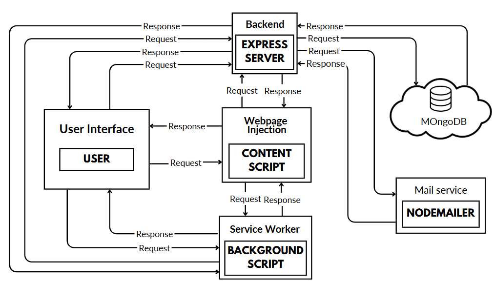

# 🛡️ Sentinel Shield – Your Online Shield for Real-Time Web Security

> 🚀 A full-stack browser extension and web platform providing real-time cybersecurity, scam detection, and personal data protection — **powered by AI.**

---

## 📌 Overview

**Sentinel Shield** is a personal web guardian that runs directly in your browser. It protects users against phishing, scams, breached credentials, malicious websites, and QR code threats in **real-time** — all while maintaining **privacy-first design**.

This was developed as a final-year B.Tech project at SHUATS, demonstrating a deep understanding of:
- Real-time system architecture
- Chrome extension APIs
- AI-assisted threat detection
- Secure full-stack engineering

> 🧠 **Stack**: React (Vite) + Express.js + MongoDB + Chrome Extension API + Generative AI (Google) + VirusTotal & ExposedOrNot APIs

---

## 🔥 Key Features

| Feature | Description |
|--------|-------------|
| 🕵️‍♂️ **Real-Time Threat Detection** | Monitors emails, websites, passwords & QR codes for malicious behavior using APIs + local logic. |
| 📬 **Email & Password Breach Lookup** | Instantly notifies users if their credentials have been exposed. |
| 🔐 **Password Strength Analyzer** | Checks password quality and warns against weak or reused credentials. |
| 👤 **Fake Identity Autofill** | Generates realistic aliases to protect user privacy on untrusted forms. |
| 📩 **Temporary Email Integration** | Use throwaway email addresses via Emailnator — no spam, no exposure. |
| 🤖 **AI-Powered Scam Detection** | Analyses text/email content with Gemini API to flag suspicious patterns. |
| 🧭 **Website Safety Score** | Checks URL credibility using VirusTotal & URLVoid and alerts users live. |
| 📸 **QR Code Scanner** | Decodes and evaluates QR targets before you scan them. |
| 📊 **User Dashboard** | Interactive dashboard shows personal risk score, breach history, password ratings & more. |
| ✉️ **Data Deletion Helper** | Provide Steps or Generates templates to request account/data deletion from services. |

---

## 🧠 Architecture

> This architecture shows how the Sentinel Shield Chrome Extension interacts with the backend systems.

### 🧩 Key Components

- **User Interface (UI)**  
  The popup or browser action users interact with inside the Chrome Extension. It sends requests to both the **Content Script** and **Background Script** based on user actions.

- **Content Script (Webpage Injection)**  
  Injected into every page the user visits. Intercepts form fields, links, QR codes, and potentially dangerous elements. Sends threat detection requests to the backend.

- **Background Script (Service Worker)**  
  Acts as a central message router inside the extension. Communicates with content scripts, backend, and UI. Handles long-running tasks like authentication, breach checks, and caching.

- **Express Backend Server**  
  Node.js server responsible for:
  - Handling API requests from the extension
  - Querying MongoDB for logs, breach data, and user profiles
  - Interfacing with AI modules and threat intelligence APIs

- **MongoDB Database**  
  Stores breach logs, scanned QR content, user session data, and security reports.

- **Nodemailer**  
  Sends OTPsto users securely.

---

## 🖥️ Modules Overview

| Component         | Description |
|------------------|-------------|
| **Chrome Extension (Frontend)** | Built with React + Vite + CSS. Offers popup, toggles, right-click actions, and notifications. |
| **Express Backend (Node.js)**  | Handles OTP auth, breach checks, threat analysis, API routing. Integrates with MongoDB. |
| **MongoDB (Database)**         | Stores breach history, password scores, QR check logs, session data. |
| **Content/Background Scripts** | Inject logic into visited websites, analyze form fields, evaluate QR codes. |
| **Generative AI Integration**  | Uses Google’s AI API to detect scam messages and evaluate text input. |

---

## 🌐 Real-World Use Case

> 🧑‍💻 Deployed and tested by over a dozen users with varied digital habits.

- Prevented multiple scam link clicks in real time
- Detected >15 email breaches during demo
- Achieved within seconds detection latency for phishing websites
- Reduced fake sign-ups using autofilled aliases
- Ran seamlessly across Chrome, Edge, and Brave browsers
---

## 🔮 Future Scope

- 📱 Mobile app (Flutter/React Native)
- 🎮 Gamified user education (anti-phishing simulation)
- 🧾 One-click data deletion automation
- 🌐 Multi-language UI (for global access)
- 🛠️ Enterprise admin panel + usage analytics

---

## 🧑‍💻 About the Author

Developed by **Shiv Dwivedi**  
> B.Tech (CSE) – SHUATS, Prayagraj  
> Cybersecurity enthusiast | AI Explorer | Full-stack developer 

🧑‍🏫 **Project Advisors**:  
- Dr. Tulika (Assistant Professor)  
---

## ⭐ Like this Project?

If this inspired you or helped you, give it a ⭐ on GitHub and drop a message.  
Let’s make the web safer — together!

